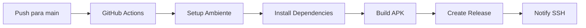

# 🚀 Guia de Deploy - Calculadora Mobile

Este guia irá te ajudar a configurar o deploy automático da sua calculadora usando GitHub Actions e SSH.

## 📋 Pré-requisitos

- Conta no GitHub
- Repositório criado no GitHub
- Servidor com SSH (opcional)

## 🛠️ Configuração Inicial

### 1. Subir o código para o GitHub

```bash
# Se ainda não criou o repositório no GitHub, crie primeiro
# Depois execute os comandos abaixo:

git add .
git commit -m "🚀 Projeto inicial da calculadora"
git branch -M main
git remote add origin https://github.com/SEU_USUARIO/SEU_REPOSITORIO.git
git push -u origin main
```

### 2. Configurar Secrets do GitHub (SSH - Opcional)

Se você quiser receber notificações via SSH quando o build for concluído:

1. Vá no seu repositório GitHub
2. Clique em **Settings** → **Secrets and variables** → **Actions**
3. Clique em **New repository secret**
4. Adicione os seguintes secrets:

| Nome | Valor | Descrição |
|------|-------|-----------|
| `SSH_HOST` | `192.168.1.100` | IP do seu servidor |
| `SSH_USERNAME` | `usuario` | Usuário SSH |
| `SSH_PRIVATE_KEY` | `-----BEGIN OPENSSH...` | Chave privada SSH |
| `SSH_PORT` | `22` | Porta SSH (opcional) |

#### Como gerar chave SSH:

```bash
# Gerar nova chave SSH
ssh-keygen -t rsa -b 4096 -C "seu-email@example.com"

# Copiar chave pública para o servidor
ssh-copy-id usuario@192.168.1.100

# Mostrar chave privada (para adicionar no GitHub Secret)
cat ~/.ssh/id_rsa
```

## ⚙️ Como Funciona o Build Automático

O arquivo `.github/workflows/build-apk.yml` está configurado para:

1. **Trigger**: Executa sempre que você faz push para `main` ou `master`
2. **Ambiente**: Ubuntu com Node.js 18, Java 11 e Android SDK
3. **Build**: Compila o APK de release
4. **Release**: Cria uma release automática com o APK
5. **SSH**: (Opcional) Notifica via SSH quando concluído

### Processo completo:



## 📱 Fazer Deploy

### Método 1: Push direto

```bash
# Fazer alterações no código
# ...

# Commit e push
git add .
git commit -m "✨ Nova funcionalidade"
git push origin main

# O build será iniciado automaticamente
```

### Método 2: Pull Request

1. Crie uma branch:
   ```bash
   git checkout -b feature/nova-funcionalidade
   ```

2. Faça as alterações e commit:
   ```bash
   git add .
   git commit -m "✨ Adiciona nova funcionalidade"
   git push origin feature/nova-funcionalidade
   ```

3. Abra um Pull Request no GitHub
4. Após merge, o build será executado automaticamente

## 📦 Download do APK

Após o build ser concluído:

1. Vá na aba **Releases** do seu repositório
2. Baixe o arquivo `app-release.apk` da versão mais recente
3. Instale no seu dispositivo Android

### URL direta:
```
https://github.com/SEU_USUARIO/SEU_REPOSITORIO/releases/latest
```

## 🔧 Configurações Avançadas

### Personalizar o build

Edite o arquivo `.github/workflows/build-apk.yml` para:

- Mudar versão do Node.js
- Adicionar testes antes do build
- Configurar assinatura customizada
- Adicionar notificações por email/Slack

### Exemplo de customização:

```yaml
# Adicionar testes
- name: Run tests
  run: npm test

# Notificação Slack
- name: Slack Notification
  uses: 8398a7/action-slack@v3
  with:
    status: ${{ job.status }}
    webhook_url: ${{ secrets.SLACK_WEBHOOK }}
```

## 🐛 Solução de Problemas

### Build falha com erro de dependências

```bash
# Limpar cache local
npm start -- --reset-cache
rm -rf node_modules package-lock.json
npm install
```

### APK não está sendo gerado

1. Verifique os logs na aba "Actions"
2. Certifique-se de que todos os arquivos foram commitados
3. Verifique se o `package.json` está correto

### SSH não está funcionando

1. Teste a conexão SSH manualmente:
   ```bash
   ssh usuario@192.168.1.100
   ```

2. Verifique se os secrets estão configurados corretamente
3. A chave privada deve incluir as linhas BEGIN/END

### Build demora muito

O build pode levar 5-15 minutos dependendo da infraestrutura do GitHub. Isto é normal.

## 📊 Monitoramento

### Acompanhar builds

1. Vá na aba **Actions** do repositório
2. Clique no workflow em execução
3. Veja os logs em tempo real

### Histórico de releases

- Todas as releases ficam salvas na aba **Releases**
- Cada push gera uma nova versão automaticamente
- APKs antigos ficam disponíveis para download

## 🎯 Próximos Passos

1. **Teste o build**: Faça um push para testar o sistema
2. **Configure notificações**: Adicione Slack/Discord para ser notificado
3. **Adicione testes**: Configure testes automatizados
4. **Play Store**: Configure upload automático para Google Play Store

---

**💡 Dica**: Mantenha sempre o README.md atualizado com as últimas mudanças! 